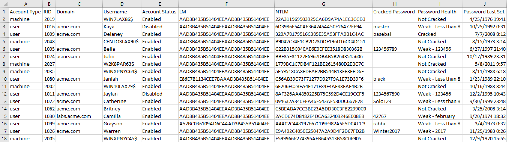
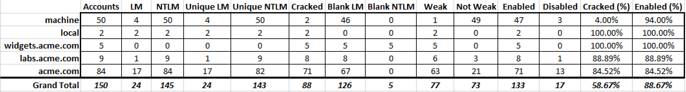

# ADPasswordHealth
A tool to evaluate the password health of Active Directory accounts.
This script will take a list of accounts, a list of cracked passwords,
and a list of password rules to determine the health of Active Directory
accounts. It will identify weak passwords leveraging user defined rules
such as common words and or password length.

Running the script will produce two output files

## Secrets Dump
Use [Impacket's secretdsdump.py](https://github.com/CoreSecurity/impacket/blob/master/examples/secretsdump.py "Impacket")
to extract hashes from Active Directory using either the online or
offline method.

Example online extraction command:

`python secretsdump.py -output secretsdump_example -pwd-last-set
-user-status acme.com\Administrator:123456@DC01.acme.com`

> The `-user-status` and `-pwd-last-set` flags are optional, but
increase the effectiveness of data manipulation

The resulting output file will be provided to this script using the
`-S` flag. There is an example file here:
`Examples/secretsdump_example.ntds`

## John the Ripper

Crack by running:

`john --format=nt --wordlist=rockyou.txt secretsdump_example.ntds`

Create an output file of all the cracked NTLM hashes with:

`john --format=nt --show secretsdump_example.ntds > cracked_ntlm`

The resulting output file will be provided to this script using the `-J`
flag. There is an example file here: `Examples/cracked_ntlm.txt`

## Active Directory User Information

Additional Active Directory account information can be passed in to
enrich the output file form this script. The input file must be in CSV
format and must contain a column named `SamAccountName`, used to match
the user accounts. There is an example file in `Examples/Get-ADUser.csv`
 directory.

One way to get this type of additional data is to use the PowerShell
Get-ADUser cmdlet and export the results to a CSV. You can install the
Active Directory PowerShell module on your workstation using this blog
post: https://4sysops.com/archives/how-to-install-the-powershell-active-directory-module/.

An example command to generate the CSV file:

`Get-ADUser -Filter * -Server acme.com -Properties SamAccountName,City,
Department|Select-Object -Property SamAccountName,City,Department|
Export-Csv -NoTypeInformation -Path C:\Get-ADUser.csv`

## Password Rules

This script leverages a list of common words to determine if a cracked
password is weak. The file is found at `Examples/password_rules.txt`.
This list of rules can be changed by the user by
running the script with the `-R` flag. The provided list contains simple
words such as _password_ or _summer_. If the word is found in **ANY**
part of the recovered password, it will be marked as _weak_. This isn't
always ideal as a password of `3f8!$%Winter33432*` would be flagged.
However, experience has shown that this is typically an edge case.

> Pro Tip: Add the company name to the password rules files to identify
common passwords such as `Acme1234`

## Password Length

This script will evaluate recovered passwords to determine if the length
of the cracked password is considered to be weak. The default is
passwords that are less than eight characters (i.e. passwords that are
only seven characters long). This can be changed with the `-N` flag.

>Experience has shown that the password for old accounts and/or
administrative accounts don't always follow the domain's password
policy.

## Password Compromise

The script can be run with the `--pwned` flag to test the recovered passwords
against the [Have I Been Pwned](https://haveibeenpwned.com/API/v2) API. 
Recovered passwords will be labeled compromised if they are discovered in the HiBP 
password dump.

## Exclude Passwords

The script can be run with the `-E` flag to exclude the password hashes
and cracked passwords from being included in the output files. This is
useful when the files are delivered to departments as part of reporting.

## Machine Accounts

Active Directory stores information for both user and machine accounts.
On average, the machine account information isn't valuable. By default,
the script does not include information about machine accounts. The
`--machine` flag can be provided to _include_ information on machine
 accounts.

>Experience has shown that sometimes machine accounts have weak
passwords. This could be fruitful for a penetration tester.

## Output

The output files will always start with `ADPassHealth_` followed by a
time stamp and end with either `Data.csv` or `Metrics.csv` (i.e.
`ADPassHealth_20170907-223411-Data.csv`). There is an example of each in
 the _Examples_ directory.



## Metrics

 * If the LM hash is blank (i.e. `AAD3B435B51404EEAAD3B435B51404EE`),
 it is not counted. This is to say that the account _is currently_
 configured with a LM password hash and we want to know that.
 * 'local' accounts are any accounts that were not prepended with a
 domain name (i.e. `acme.com\Bella` would not be local)
 * Machine accounts are any account names that end with `$`



>Image was edited

## Examples

The `Examples` directory contains example files that can be used to test
the script.

* `ADPassHealth_20170910-135811-Data.csv` - An example of the output
data file.
* `ADPassHealth_20170910-135811-Metrics.csv` - An example of the output
metrics file.
* `cracked_ntlm.txt` - An example of the output from John using the
`--show` command to show cracked hashes from `secretsdump_example.ntds.`
* `Get-ADUser.csv` - An example of the output from the PowerShell
Get-ADUser cmdlet.
* `password_rules.txt` - An example list of password rules used to
determine if a password is weak. This is the default file if one isn't
provided.
* `secretsdump_example.ntds` - An example file of the output from
Impacket's secretsdump.py.
* `source_data.xlsx` - An Excel file used to generate usernames,
passwords, hashes, domains, machine accounts, city, and department
information.

## Usage

Example command:

`python ADPasswordHealth.py -J Examples/cracked_ntlm.txt
-S Examples/secretsdump_example.ntds
-A Examples/Get-ADUser.csv
-O ./Examples/
 --machine`

```
usage: ADPasswordHealth.py [-h] -J JOHN -S SECRETS [-R RULES] [-A ADUSERINFO]
                           [-N NUMBER] [-M] [-E] [--machine] -O OUTPUT
                           [--verbose] [--debug] [--pwned]

optional arguments:
  -h, --help            show this help message and exit
  -J JOHN, --john JOHN  A file with the output from John using the --show flag
                        or hashes in this format ACME.COM\john:cracke
                        dPassword:RID:LMHash:NTLMHash::: (pwdLastSet)
                        (status). The pwdLastSet and status parts are
                        optional.
  -S SECRETS, --secrets SECRETS
                        The output from extracting a NTDS.dit file using
                        secretsdump.py. Example command is:
                        secretsdump.py -outputfile secretsdump_acme
                        -pwd-last-set -user-status
                        acme.com\Administrator@acme.com
  -R RULES, --rules RULES
                        A file containing a list of words, each on a new line,
                        that are used as rules to determine if a password is
                        weak. NOTE: if the cracked password contains the word,
                        is deemed weak.
  -A ADUSERINFO, --aduserinfo ADUSERINFO
                        An optional data set in the form of CSV output from
                        PowerShell Get-ADUser user command. Example
                        command: Get-ADUser -Filter * -Server acme.com
                        -Properties SamAccountName,City,Department|Select-
                        Object -Property SamAccountName,City,Department
                        |Export-Csv -NoTypeInformation -Path C:\Get-
                        ADUser.csv
  -N NUMBER, --number NUMBER
                        Find all instances where the cracked password is less
                        than the passed in number. Default is 8
  -M, --metrics         Disable the calculation of metrics of AD password
                        health data.
  -E, --exclude         Exclude cracked password from output
  --pwned               Check cracked passwords against Have I Been Pwned API
  --machine             Include machine accounts in results
  -O OUTPUT, --output OUTPUT
                        Output directory
  --verbose             Enable verbose Output
  --debug               Enable debug output
```